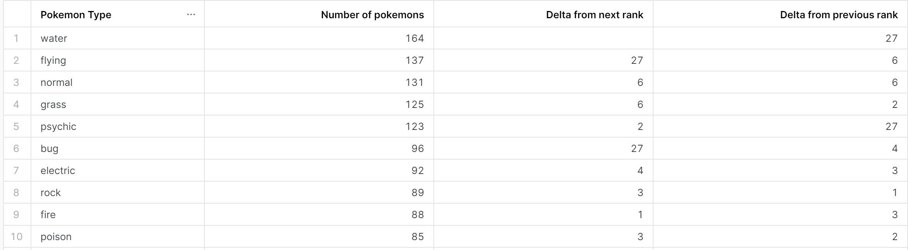
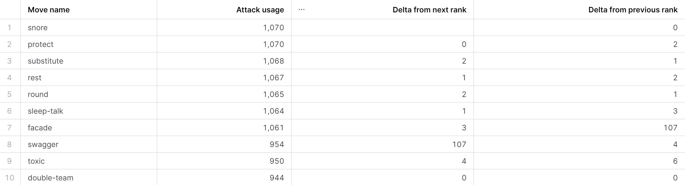
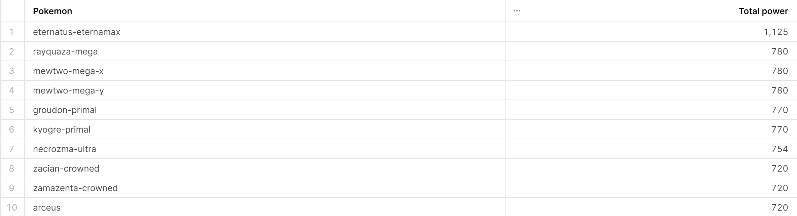
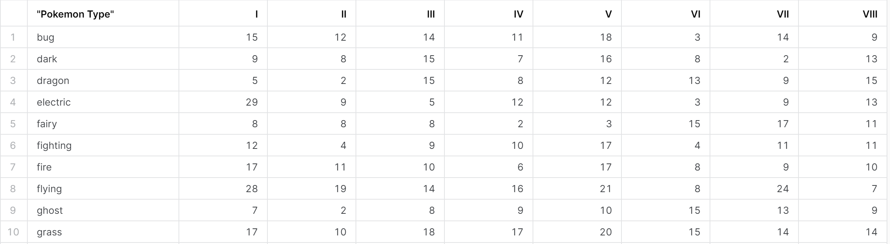
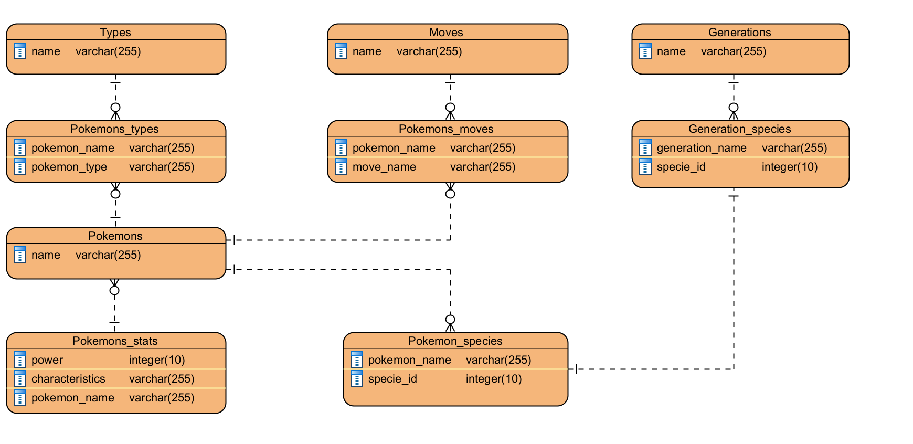

# Pokemon API
Итоговая работа для курса Data Engineering School. 

В качестве задания предлагалось создать ETL/ELT процесс для получения данных о покемонах (https://pokeapi.co/), используя цепочку 
технологий Pokemon API => Python & MWAA => S3 => snow pipe => Snowflake => DWH. Для оркестрации использовался Airflow.

Подробные требования представлены в файле task.md

## Структура папок
Проект состоит из 2 частей: 
- Код на Python для Airflow (папка Airflow). Для удобства организации:
  - В папку DAGs выделены все ДАГи: для загрузки данных, для проверки количества поколений и для очистки ненужных данных с S3)
  - В папку sharaeva_functions выделены функции для работы с API, а также вспомогательные функции для работы с S3 
- SQL-скрипт для Snowflake (папка Snowflake). **ВНИМАНИЕ! Для работы скрипта надо вставить валидные credentials!**

## Ответы на вопросы
#### Сколько покемонов в каждом типе, насколько это меньше чем у следующего по рангу типа? А насколько больше, чем у предыдущего?

#### Сколько у разных атак использующих их покемонов? + показать дельту от следующей и предыдущей по популярности атаки. 

#### Составить рейтинг покемонов по сумме их характеристик

#### Показать количество покемонов по типам и поколениям

## Архитектура warehouse

## TODO 
- добавить snowpipes
